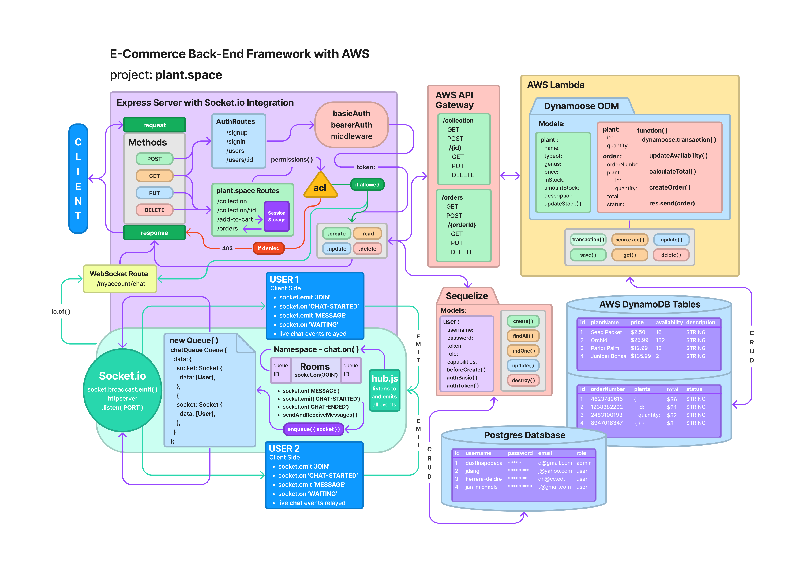
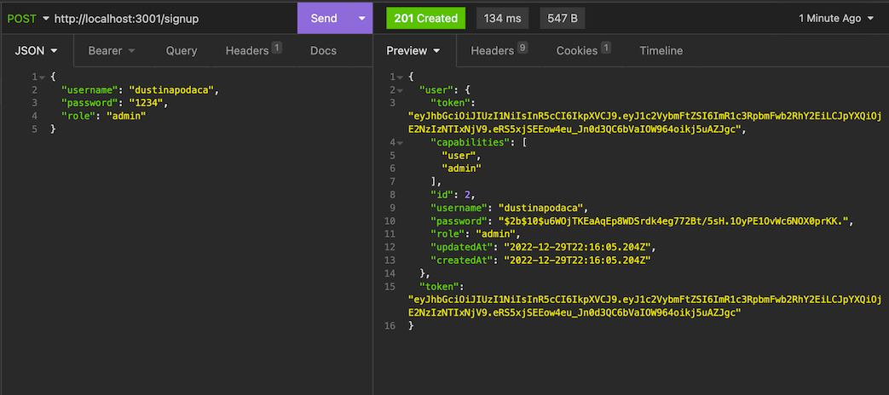
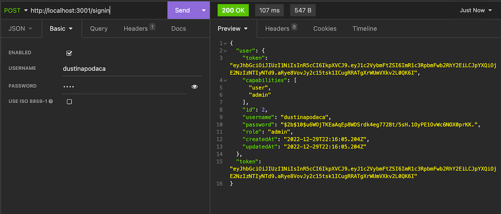
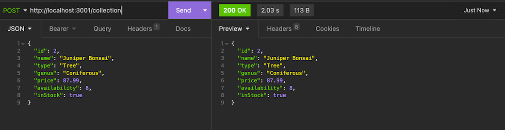
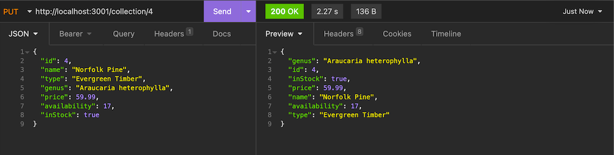
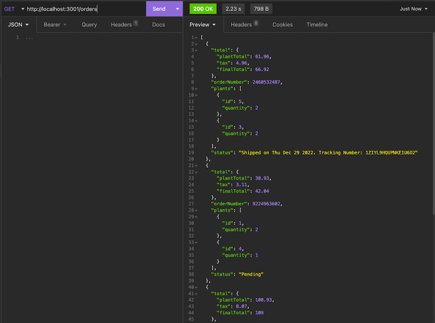
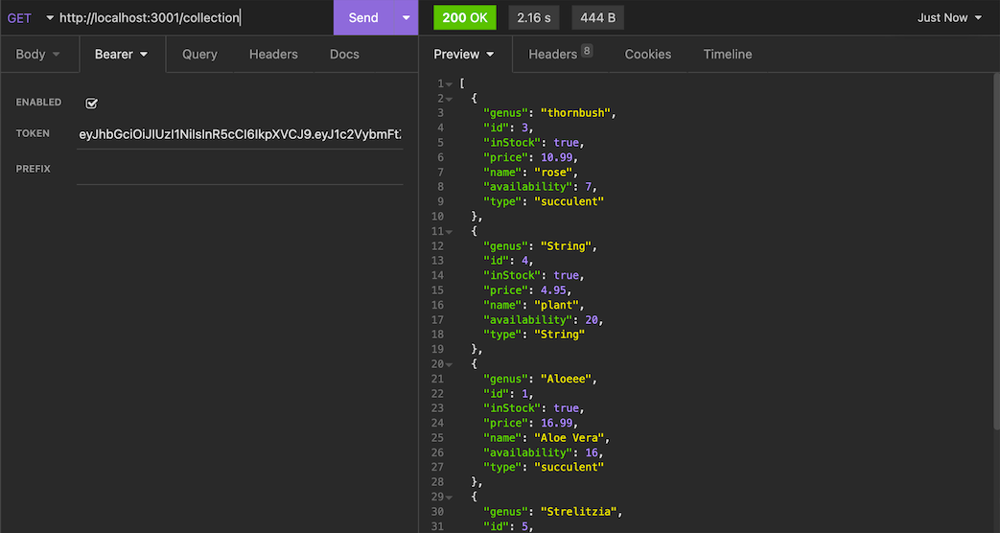
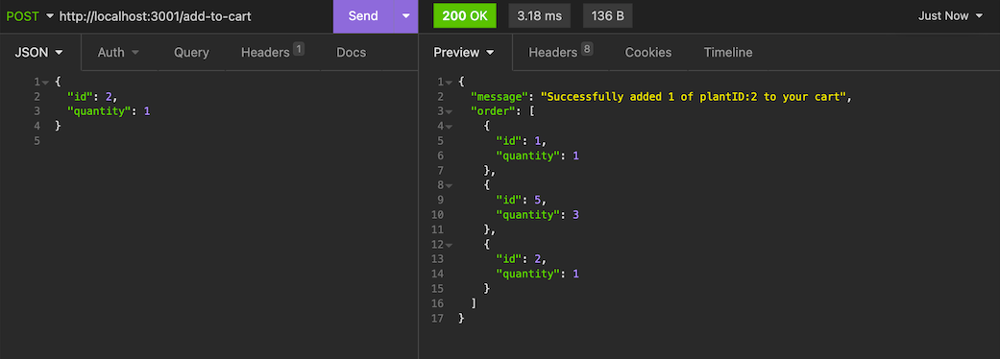
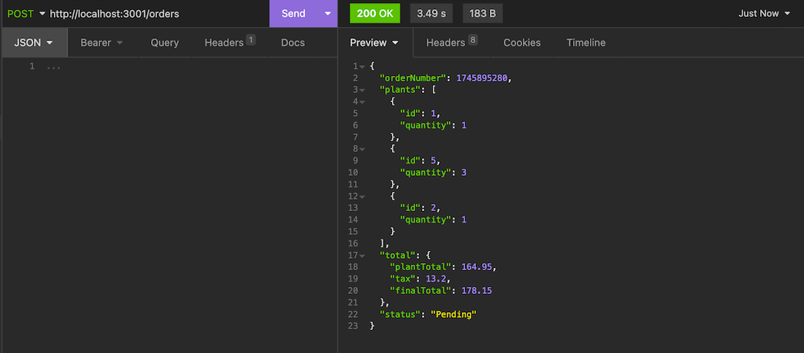
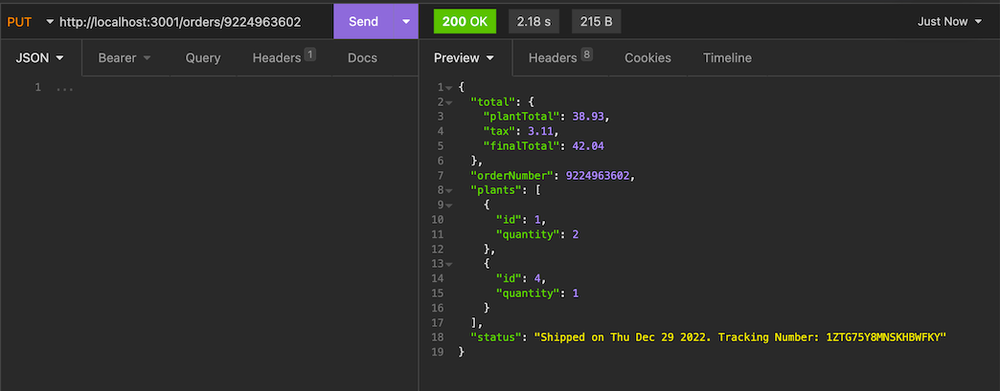

# Plant Space

### Author's: Camilla Rees, Dustin Apodaca, Megan Seibert-Hughes, Hunter Fehr

### Problem Domain

Plant Space in an online botanical store and learning platform that offers the convenience of finding the perfect plant that thrives in your climate and getting it delivered to your door.

### Links and Resources

- [Cooperation Plan](https://github.com/CHSMD/plant.space/blob/main/documentation/cooperation-plan.md)
- [Project Pitch](https://github.com/CHSMD/plant.space/blob/main/documentation/project-pitch.md)
- [Kanban Board & User Stories](https://github.com/orgs/CHSMD/projects/1)

## Deployment

- [Deployed Back-End Server](https://cognb1larg.execute-api.us-west-2.amazonaws.com/plantspace)

### Key Features & How They Work

1. Admin can login and read, create, update or delete plants in the collection, and get all customer orders
    
    
    
    
    
    

    - Lambda CRUD functions connected to API Gateway pathways

2. Customer can login, browse plant collection of plants to purchase, make an order/transaction and customize the number of items in their order

    
    
    
    
    

    -  Basic auth allows users to create and sign in to their account, and bearer auth permissions connect to plant and cart routers which pull from API gateway path and allow users to perform read, update, create or delete according to their respective role based access

3. Multiple customers can enter a chat room queue and wait their turn to message with a representative (plant nurse) to learn more about an item, get help with plant care, etc.
    
    - A queue is implemented to keep customers on a first in first out lineup
    - A socket server allows users to join rooms, emit messages, and listen for message events
    - Inquirer provides the structure for which the chat rooms functionality can be displayed

4. Deployed on AWS (API Gateway, Lambda functions, DynamoDB)
5. Tests for each feature

#### Tests

- Lambda function tests - Lambda
- Route tests - API Gateway
- Auth tests - Test suites in VS Code
- Chat room tests - Inquirer

## Change Log (Significant PRs)

- [PR 2: Initialization and Scaffolding](https://github.com/CHSMD/plant.space/pull/2)
- [PR 6: Basic Auth and ACL Permissions](https://github.com/CHSMD/plant.space/pull/6)
- [PR 7: Lambda Functions, Socket Server, and Queue](https://github.com/CHSMD/plant.space/pull/7)
- [PR 11: Socket Functionality, plantNurse Index, Debugging](https://github.com/CHSMD/plant.space/pull/11)
- [PR 12: Plant Router](https://github.com/CHSMD/plant.space/pull/12)
- [PR 14: Update Plant Route and Cart Route Permissions](https://github.com/CHSMD/plant.space/pull/14)
- [PR 16: Working Socket Connections](https://github.com/CHSMD/plant.space/pull/16)
- [PR 19: Place Order Function and Add to Cart Route](https://github.com/CHSMD/plant.space/pull/19)
- [PR 20: Clean Socket Server and Update Order Function](https://github.com/CHSMD/plant.space/pull/20)
- [PR 22: Error Handlers](https://github.com/CHSMD/plant.space/pull/22)
- [PR 23: Read One Order and Read Orders Lambda Functions complete](https://github.com/CHSMD/plant.space/pull/23)
- [PR 27: Updated User Model and Permissions](https://github.com/CHSMD/plant.space/pull/27)

## Credit and Collaborations

- Dynamoose Documentation
- Stack Overflow
- Special thanks to Ryan Galloway and Justin Hamerly

