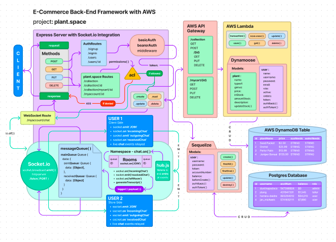

# Plant Space

### Author's: Camilla Rees, Dustin Apodaca, Megan Seibert-Hughes, Hunter Fehr

### Problem Domain
in our project we want to showcase

### Links and Resources

- [Cooperation Plan](https://github.com/CHSMD/plant.space/blob/main/documentation/cooperation-plan.md)
- [Project Pitch](https://github.com/CHSMD/plant.space/blob/main/documentation/project-pitch.md)
- [Kanban Board & User Stories](https://github.com/orgs/CHSMD/projects/1)

- [ci/cd](http://xyz.com) (GitHub Actions)
- [back-end server url](http://xyz.com) (when applicable)
- [front-end application](http://xyz.com) (when applicable)

## Deployment
- [Deployed Server]()

### How it Works

### Key Features

#### Tests

- How do you run tests?
- Any tests of note?
- Describe any tests that you did not complete, skipped, etc

#### UML

Link to an image of the UML for your application and response to events

## Change Log

[PR 2: Initialization and Scaffolding](https://github.com/CHSMD/plant.space/pull/2)
[PR 6: Basic Auth and ACL Permissions](https://github.com/CHSMD/plant.space/pull/6)
[PR 7: Lambda Functions, Socket Server, and Queue](https://github.com/CHSMD/plant.space/pull/7)
[PR 11: Socket Functionality, plantNurse Index, Debugging](https://github.com/CHSMD/plant.space/pull/11)
[PR 12: Plant Router](https://github.com/CHSMD/plant.space/pull/12)

## Credit and Collaborations
